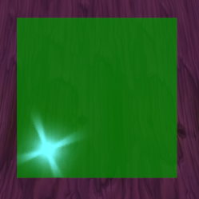

# First Steps: Example 3 - Show cooldown animation

**I don't speak English. It's google translate. Sorry.**

---

### 1. Create cooldown animation object:
```
local myCooldown = CreateFrame('MODEL', nil, <ParentFrame>, 'CooldownFrameTemplate')
```
*Comment: you can use double quotes instead of single quotes. And use "Model" instead of "MODEL". It doesn't matter, it's just my style.*

This object can work correctly if you don't give it a global name. Or you can use only the global name:
```
CreateFrame('MODEL', 'myCooldown', <ParentFrame>, 'CooldownFrameTemplate')
```

### 2. Set position and size for cooldown animation object:

Typically, the position and size is set like this:
```
myCooldown:SetPoint('TOP', <RelativeFrame>)
myCooldown:SetWidth(64)
myCooldown:SetHeight(64)
```
But for this object, this code does not work. In my experience, the object is automatically anchored to the bottom left corner of the parent frame. Maybe this anchor can be changed, but I don't know how. You can see this anchor in this example (and start cooldown animation - this will be written below):
```
local frame = CreateFrame('FRAME')
frame:SetBackdrop({bgFile = 'Interface\\Tooltips\\UI-Tooltip-Background'})
frame:SetBackdropColor(0, 1, 0, 1)
frame:SetPoint('CENTER', UIParent)
frame:SetWidth(200)
frame:SetHeight(200)

local myCooldown = CreateFrame('MODEL', nil, frame, 'CooldownFrameTemplate')
```
The object is created with a fixed size. I was able to change the size using the "SetModelScale" function. This function works like scaling, for example `myCooldown:SetModelScale(1.5)` means that the object will become one and a half times larger (compared to standard size).

### 3. Start cooldown animation:

To start the animation, use call to "CooldownFrame_SetTimer" function. The declaration of this function can be found [here](https://www.townlong-yak.com/framexml/1.12.1/Cooldown.lua#2). For example, let's set the cooldown time to 10 seconds:
```
CooldownFrame_SetTimer(myCooldown, GetTime(), 10, 1)
```
The first parameter is the cooldown object. The second parameter is the start time. The third parameter is the duration of the cooldown animation. The fourth parameter must be a number greater than zero to start the animation.

Using this example, you can see the animation if you enter the `/test` command:
```
local frame = CreateFrame('FRAME')
frame:SetBackdrop({bgFile = 'Interface\\Tooltips\\UI-Tooltip-Background'})
frame:SetBackdropColor(0, 1, 0, 1)
frame:SetPoint('CENTER', UIParent)
frame:SetWidth(200)
frame:SetHeight(200)

local myCooldown = CreateFrame('MODEL', nil, frame, 'CooldownFrameTemplate')
myCooldown:SetModelScale(1.5)

SLASH_TEST1 = '/test'
function SlashCmdList.TEST()
    CooldownFrame_SetTimer(myCooldown, GetTime(), 10, 1)
end
```
Animation on screen:


This object has the feature - After the circle animation is completed, the highlight animation starts:



If you want to remove the highlight animation, then you will need to write your own function similar to "[CooldownFrame_OnUpdateModel](https://www.townlong-yak.com/framexml/1.12.1/Cooldown.lua#14)" (but not rewrite it, otherwise it will break the spell cooldown animations). It seems to look like this:
```
local frame = CreateFrame('FRAME')
frame:SetBackdrop({bgFile = 'Interface\\Tooltips\\UI-Tooltip-Background'})
frame:SetBackdropColor(0, 1, 0, 1)
frame:SetPoint('CENTER', UIParent)
frame:SetWidth(200)
frame:SetHeight(200)

local myCooldown = CreateFrame('MODEL', nil, frame, 'CooldownFrameTemplate')
myCooldown:SetScript('OnUpdateModel', function() myCooldown_OnUpdateModel() end)
myCooldown:SetModelScale(1.5)

function myCooldown_OnUpdateModel()
    if this.stopping == 0 then
        local finished = (GetTime() - this.start) / this.duration
        if finished < 1.0 then
            local time = finished * 1000
            this:SetSequenceTime(0, time)
            return
        end
        this.stopping = 1
    else
        this:AdvanceTime()
    end
end

SLASH_TEST1 = '/test'
function SlashCmdList.TEST()
    CooldownFrame_SetTimer(myCooldown, GetTime(), 10, 1)
end
```
